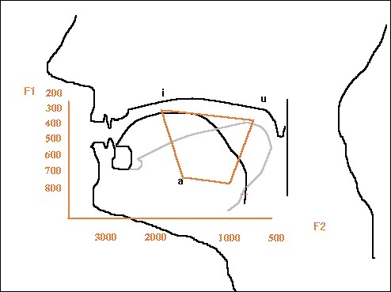
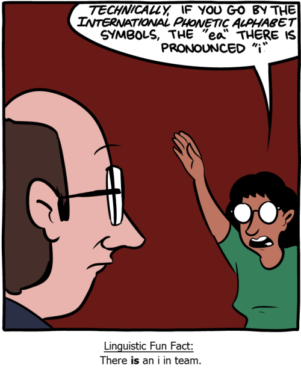
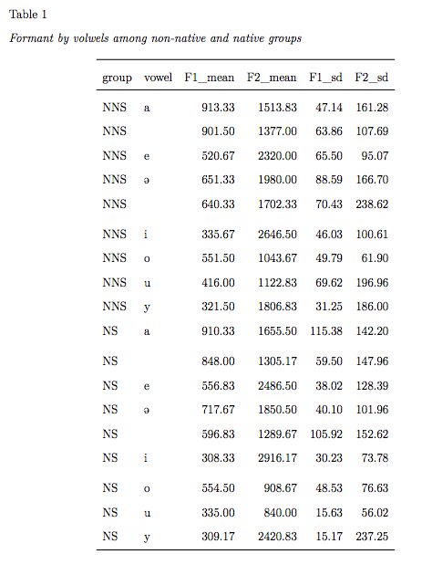

# Data Visdualization on Madarin Vowels

## Introduction

* Mandarin Chinese has a five-vowel system 
1. [yi], [yu], [wu], [en] and [ai]
2. Four allophones for the **mid vovel**: [e], [o], [en] and [e]
3. Two allophones for the **low vovel**: [ai] and [ao]

## Research Gap
- What are the individual variances when producing these 9 vowels? 
- Vowel space in Chinese? 

## Current Study
This study investigates **native Chinese speakers'** vowel distribution and **non-native Chinese speakers'** vowel distribution



## Methods
### Participants
- 6 female native Mandarin speakers (NS) & 6 female non-native Mandarin speakers (NNS)
- Average age
  a. NS Mandarin speakers was 26.3 (range: 23-30)
  b. NNS Mandarin speakers was 22.3 (range: 18-28)
- Length of study: 6 months 

## Methods 
### Speech materials 
- 9 Chinese sentences
- Each sentence includes one of the following nine vowels: [yi], [yu], [wu], [e], [o], [en], [e], [ai], [ao]. 
- Each vowel appears after the aspirated bilabial stop [p] with a high tone (55).

## Methods
### Procedure
- Sentence-repetition oral task
- Non-native speakers and native Chinese speakers were asked to read the sentences twice.
- Formant 1 (F1) and Formant 2 (F2) were measured in the vowel mid-point for each vowel shown in the spectrogram through Praat.

# Ting-fen's Journey
## Additions


## Deletions


## Challenges faced along the way: 


## Victories:
Google
@datalorax


## Challenges facing & Next R Hurdle to Tackle 


# Teresa's R Journey

```{r setup, include = FALSE}
library("papaja")
library("tidyverse")
library("rio")
library("here")
library("janitor")
library("tinytex")
library("knitr")
knitr::opts_chunk$set(warning = FALSE,
                      message = FALSE,
                      error = TRUE,
                      echo = TRUE,
                      fig.width = 6.5,
                      fig.height = 8
                      )
theme_set(theme_minimal(base_size = 8))

```

```{r load_data, include = FALSE}
df <- import(here("data", "datanew.xlsx"),
             setclass = "tbl_df")

head(df)
```

## Looking at Our Data
```{r echo = FALSE}
head(df)
```
* Data is definitely NOT tidy!
    + Variables (F1, F2) don't have thier own columns.
    + Each row includes multiple observations from multiple vowels.
  
* Confidence level: 5/5 with `dplyr::spread` and `dplyr::gather` 

## What else? (1)
```{r}
names(df)
```
*  Varibles' name are not clean.
    + Confidence level: 5/5 with `janitor::clean_names`

## What else? (2)
```{r}
print(df$X__1)
```
* X__1 contains **id** and **group** (NS & NNS).
    + Confidence level: 2/5 with `dplyr::separate`
        - sep = ?
    
* Duplicate id number for NS and NNS
    + Confidence level: 0/5 
        - use `dplyr::case_when` ?

## Tidy data step 1:  fix x__1
```{r tidy_data }
tidy_df1 <- df %>% 
  clean_names(case = "snake") %>% 
  separate(x_1, into = c("group", "id"),
           sep = "(?<=[A-Za-z])(?=[0-9])") %>%  #sep = -1 also works
  mutate(id = case_when(
   group == "NNS" & id == '1' ~  '7',
   group == "NNS" & id == '2' ~  '8',
   group == "NNS" & id == '3' ~  '9',
   group == "NNS" & id == '4' ~  '10',
   group == "NNS" & id == '5' ~  '11',
   group == "NNS" & id == '6' ~  '12',
   TRUE ~ id
   )) %>% 
  mutate(group = as.factor(group),
        id = as.numeric(id))   
```

## 
```{r}
head(df, n = 3)
head(tidy_df1, n = 3)
```


## Tidy data step 2:  gather
```{r}
tidy_df2 <- tidy_df1 %>% 
  gather(vowel, value, -1:-6) %>%
  mutate(vowel = as.factor(vowel)) 

head(tidy_df2)
```

## Tidy data step 3:  spread
```{r}
tidy_df <- tidy_df2 %>% 
  spread(mean, value) %>%
  #reorder variables & discard gender
  select(id, group, age, height, vowel, F1, F2) %>% 
  arrange(id)

head(tidy_df)
```


## Plot Data Like This
<div class="centered">

</div>
* Raw Data (data points from each individual)
* Group Data (mean values from each group)

## Code for Figure 1 (for Raw Data)
```{r figure1, results='hide'}
figure1_pre <- tidy_df %>% 
  ggplot(aes(x = F2, y = F1, color = vowel)) + 
  geom_point(size = 3) +
  facet_wrap(~ group) + 
  theme_classic() 

```

##
```{r echo = FALSE, fig.height = 4.5}
figure1_pre
```

* Couple issues:
    + X and Y axes need to be rotated.
    + Labels are not in a conventional order.

## Refined Code for Figure 1 
```{r}
figure1_post <- tidy_df %>% 
  ggplot(aes(x = F2, y = F1, color = vowel)) + 
  geom_point(size = 3) +
  facet_wrap(~ group) + 
  theme_classic() +
  
  #reverse x and y to meet the perception of sounds
  scale_x_reverse() +  
  scale_y_reverse() +
  
  #reorder vowel based on IPA order
  scale_color_discrete(breaks = c("yi", "yu", 
                                  "wu", "ye", 
                                  "wo", "en", 
                                  "e", "ai", 
                                  "ao")) +
  labs(title = "Vowel Distribution among All Non-native and Native Speakers")
```

##
```{r echo = FALSE, fig.height = 5}
figure1_post
```

* Inefficient references due to 9 vowels. 

## 
<div class="centered">

</div>

##
<div class="centered">

</div>

## Acknowledge
* Google
* Special Thank You to Joey Stanley !
    + [Joey's blog](http://joeystanley.com/blog/making-vowel-plots-in-r-part-1) 
    + Making vowel plots in R

## Code for Figure 2 (for Group Mean) 
```{r figure2, results ='hide'}
smry_df <- tidy_df %>% 
  group_by(group, vowel) %>% 
  summarize_at(vars(F1, F2), funs(mean, sd)) 
  

figure2 <- smry_df %>% 
  ggplot(aes(x = F2_mean, y = F1_mean)) +
    
    # adds text directly to the plot
    geom_label(aes(label = vowel, color = group)) +
  
    scale_x_reverse() +  
    scale_y_reverse() +
    theme_classic() +
    labs(title = "Mean Vowel Distribution between Non-native and Native Speakers",
         x = "F2",
         y = "F1")

```

##
```{r fig.height = 5}
figure2
```


## More to Explore !
```{r figure3, echo = FALSE, fig.height = 5 }
figure3 <- 
  ggplot(data = tidy_df, aes(x = F2, y = F1 )) +
  geom_label(data = smry_df, aes(x = F2_mean, y = F1_mean, 
                                 label = vowel, fill = group),
             alpha = 0.2) +
  geom_point(aes(color = vowel, shape = group),
             size = 3, alpha = 0.4) +
  stat_ellipse(aes(color = vowel), level = 0.67) +
  scale_x_reverse() +  
  scale_y_reverse() +
  theme_classic() +
  labs(title = "Individual and Group Vowel Distribution",
       subtitle = "The size of output ellipses in standard deviations.") +
  guides(color = FALSE)

figure3
```

##
```{r, eval = FALSE, echo = TRUE}
figure3 <- 
  ggplot(data = tidy_df, aes(x = F2, y = F1 )) +
  geom_label(data = smry_df, aes(x = F2_mean, y = F1_mean, 
                                 label = vowel, fill = group),
             alpha = 0.2) +
  geom_point(aes(color = vowel, shape = group),
             size = 3, alpha = 0.4) +
  stat_ellipse(aes(color = vowel), level = 0.67) +
  scale_x_reverse() +  
  scale_y_reverse() +
  theme_classic() +
  labs(title = "Individual and Group Vowel Distribution",
       subtitle = "The size of output ellipses in standard deviations.") +
  guides(color = FALSE)
```


# Jun's Journey
## Jun's frustration: Table
```{r smrytable, echo = TRUE}
smry_df %>% 
  kable(format = "html",digits = 2,caption = "Table1",booktabs = T)
kable(smry_df)
```

##Spread: F1 mean
```{r spread1, echo= TRUE}
table_f1mean <- smry_df %>% 
  select(1:3) %>% 
  spread(vowel,F1_mean) 

table_f1mean
```

##Spread: F2 mean
```{r spread2, echo= TRUE}
table_f2mean <- smry_df %>%
  select(1:2,4) %>% 
  spread(vowel,F2_mean) 

table_f2mean
```

##New fuction: bind_rows
```{r bindrows, echo= TRUE}
bind_rows(table_f1mean,table_f2mean) -> bindtables 
bindtables
```

##New: add a column and rename the items in this column
```{r add, echo= TRUE}
bindtables["Mean"] <- c("F1","","F2","")
bindtables
```

##New: move the column to the front
```{r move, echo= TRUE}
bindtables_new <- bindtables[colnames(bindtables)[c(11,1:10)]]
bindtables_new
```

##Yay! A better table!
```{r newtable, echo= TRUE}
bindtables_new %>% 
  kable(format = "html",digits = 2,caption = "Table 1", booktabs = T) 
```

## Challenges we are still facing: M (SD)


# Steffi's R Journey
## Steffi's Challenge: IPA symbols
* The importance of IPA symbols
    + How to **SHOW** IPA symbols in RStudio?
    + How to **KNIT** IPA symbols to PDF in APA format?

<div style="width:300px; height:100px", class="centered">


## Inserting IPA symbols
```{r packages, echo=TRUE}
install.packages("linguisticsdown")
devtools::install_github("liao961120/linguisticsdown")
```

## linguisticsdown 1.1.0


## Editing Output & Header
* output: 
- papaja::apa6_pdf:
- toc: true
- toc_depth: 5
- latex_engine: xelatex
- includes:
- in_header: header.tex

***
* header-includes:
-  \DeclareUnicodeCharacter{251}{ }
-  \DeclareUnicodeCharacter{259}{ }
-  \DeclareUnicodeCharacter{264}{ }  
-  \usepackage{tipa}
 
```tex
\newfontfamily\ipa{Doulos SIL} 
```

## Problem solved
- IPA symbols cannot be properly rendered when output to PDF.

### IPA symbols in R Markdown
<div class="centered">


***
<div class="centered">


<div class="centered">


***
<div class="centered">


***
<div class="centered">


***
<div class="centered">


## Challenges we are still facing: output issue
* 3 out of 9 symbols disappeared in plots.

***
<div class="centered">


***
<div class="centered">


***
<div class="centered">


## Substantive findings
* How to support Linguistics-related doucument writing in R Markdown?
    + linguisticsdown
    + phonTools
    + ....
    
## Next R hurdle to tackle
* Conditional compilation
- Templates: APA article & Support_IPA
* In-line codes for plots? 
- r linguisticsdown::cond_cmpl("ə")


