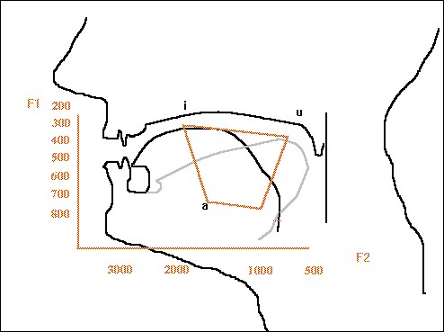

```{r setup, include = FALSE}
library("papaja")
library("tidyverse")
library("rio")
library("here")
library("janitor")
library("tinytex")
library("knitr")
knitr::opts_chunk$set(warning = FALSE,
                      message = FALSE,
                      error = TRUE,
                      fig.width = 6.5,
                      fig.height = 8
                      )
theme_set(theme_minimal(base_size = 8))

```

```{r load_data, include = FALSE}
df <- import(here("data", "datanew.xlsx"),
             setclass = "tbl_df")

head(df)

```
```{r tidy_data, include = FALSE}
tidy_df <- df %>% 
  clean_names(case = "snake") %>% 
  separate(x_1, into = c("group", "id"),
           sep = "(?<=[A-Za-z])(?=[0-9])") %>%  #seperate x_1 to group (NS vs. NNS) & id
  mutate(id = case_when(
   group == "NNS" & id == '1' ~  '7',
   group == "NNS" & id == '2' ~  '8',
   group == "NNS" & id == '3' ~  '9',
   group == "NNS" & id == '4' ~  '10',
   group == "NNS" & id == '5' ~  '11',
   group == "NNS" & id == '6' ~  '12',
   )) %>%  # fix duplicate id numbers
  mutate(group = as.factor(group),
        id = as.numeric(id)) %>%  #rename variables & set the variable types
  gather(vowel, value, -1:-6) %>%
  mutate(vowel = as.factor(vowel))%>%
  spread(mean, value) %>%
  filter(gender == "F") %>%   #redundant, just for meet rubric
  select(id, group, age, height, vowel, F1, F2) %>% #reorder variables & discard gender
  arrange(id)

head(tidy_df)


```
```{r smr_data, include= FALSE}
smry_df <- tidy_df %>% 
  group_by(group, vowel) %>% 
  summarize_at(vars(F1, F2), funs(mean, sd)) 
  

head(smry_df)
```


\newpage
# Introduction
It is generally agreed that Mandarin Chinese has a five-vowel system [see @hinton2006]. These five vowels are [yi], [yu], [wu], [en] and [ai]. Among these vowels, the mid vowel has four allophones: [e], [o], [en] and [e]; and the low vowel has two allophones: [ai] and [ao]. However, little attention has been paid to the individual variances when producing these nine vowels. Few researchers did empirical studies to examine @ashby2005 vowel space of Chinese. In order to fill these gaps, this study investigates the vowel distribution of native Chinese speakers, aiming to determine whether native Chinese speakers show similar patterns when producing Chinese vowels and whether their patterns look similar to Roach’s [-@roach2004] proposal of Chinese vowel chart. In addition, this current work examines the vowel distribution of American English learners of Chinese, with the purpose of finding out whether non-native speakers perform similarly to native speakers in the vowel production.




```{r mean_age}
mean_age <- tidy_df %>% 
  group_by(group) %>% 
  summarize(mean_age = round(mean(age),2))
```

# Methods
##Participants
Six female native (L1) Mandarin speakers and six female non-native (L2) Mandarin speakers participated in the study. The mean age of the L1 Mandarin speakers is `r mean_age$mean_age[1]` (range: 23-30) and that of the L2 Mandarin speakers is `r mean_age$mean_age[2]` (range: 18-28). Among L1 Mandarin speakers, two speakers are from northern Mainland China (Beijing and Tianjin), three speakers were from southern Mainland China (Nanjing, Chengdu and Chongqing), and one speaker was from Taiwan. The Taiwanese participant identified Mandarin as her most fluent language. All the six L2 Mandarin speakers’ native language was American English. They were all novice-low learners who enrolled in first-year accelerated Chinese language course at the same university. They had learned Mandarin for six months and none of them had any study-abroad experience.

## Speech materials 
We prepared nine Chinese sentences for speech materials. Each sentence includes one of the following nine vowels: [yi], [yu], [wu], [e], [o], [en], [e], [ai], [ao]. Each vowel appears after the aspirated bilabial stop [p] with a high tone (55).

## Procedure
Productions were elicited in a sentence-repetition oral task. Non-native speakers (NNS) and native Chinese speakers (NS) were asked to read the sentences twice. All participants read the speech materials for practice once before recording. Recordings were made in a quiet study room in the library using Praat Sound Recorder with 44,100 Hz sampling frequency, and then these recordings were saved as wav files on a laptop. 
Formant 1 (F1) and Formant 2 (F2) were measured in the vowel mid-point for each vowel shown in the spectrogram. All measurement was conducted using Praat program on the same laptop. After the measurement, the mean F1 and F2 values were plotted in charts using the program R to generate vowel distribution for each speaker.

#Results and discussion 
##Native speaker patterns
Table 1 shows the mean F1 and F2 values of nine Chinese vowels for native speakers. Regarding F2 values, data shows that [yi] had the highest F2 values for all native speakers, and [wu] had the lowest F2 values for NS2 and NS3, but not for NS1. As for F1 values, three NS also had different lowest and highest values. While [yi] had the lowest F1 value and [ao] had the highest F1 value for NS1 and NS3, NS2’s [yu] had the lowest F1 value and her [ai] had the highest F1 value. 

```{r table1, echo= FALSE}
smry_df %>% 
  kable(format = "latex",
        digits = 2,
        caption = "Formant by volwels among non-native and native groups",
        booktabs = T) 

  # kable_styling(bootstrap_options = "striped", 
  #               full_width = F) 
```

Clearer vowel distribution for each native speaker can be seen in the formant plots (Figure 1-3). According to the “vowel dispersion principle”, the vowel quadrilateral can be viewed as “a perceptual space in which vowels are located in the oral cavity” (Ashby and Maidment, 2005). In this study, the vowel quadrilateral is shown as formant plots where the Y-axis is F1 (Hz) that corresponds to the height of the tongue position; while the X-axis is F2 (Hz) that indicates the backness of the tongue position for each vowel (Figure 1 -3). 

```{r figure1, echo= FALSE}
##figure 1 
tidy_df %>% 
  ggplot(aes(x = F2, y = F1, color = vowel)) + 
  geom_point(size = 3) +
  scale_x_reverse() +  #reverse x and y to meet the perception of sounds
  scale_y_reverse() +
  facet_wrap(~ group) + 
  theme_classic() +
  scale_color_discrete(breaks = c("yi", "yu", 
                                  "wu", "ye", 
                                  "wo", "en", 
                                  "e", "ai", 
                                  "ao"))  #reorder vowel based on IPA order
```

```{r figure2, echo= FALSE}
smry_df %>% 
  ggplot(aes(x = F2_mean, y = F1_mean, 
             label = vowel, color = group)) +
    geom_label() +
    scale_x_reverse() +  
    scale_y_reverse() +
    theme_classic()

```

```{r figure3, echo = FALSE}
ggplot(data = tidy_df, aes(x = F2, y = F1 )) +
  geom_label(data = smry_df, aes(x = F2_mean, y = F1_mean, 
                                 label = vowel, fill = group),
             alpha = 0.2) +
  geom_point(aes(color = vowel, shape = group),
             size = 3, alpha = 0.4) +
  stat_ellipse(aes(color = vowel), level = 0.67) +
  scale_x_reverse() +  
  scale_y_reverse() +
  theme_classic() +
  guides(color = FALSE)

```

##Second language examination


#Conclusion

\newpage

# References

\begingroup
\setlength{\parindent}{-0.5in}
\setlength{\leftskip}{0.5in}

<div id = "refs"></div>
\endgroup
